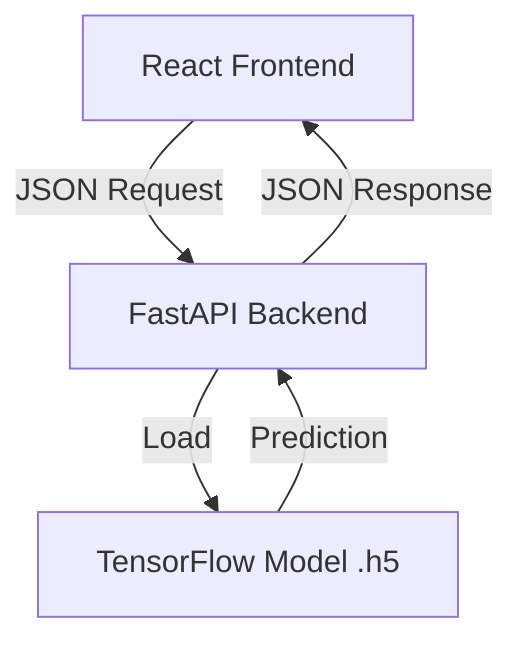

# Advertising Sales Prediction AI


A professional-grade, full-stack AI application that predicts sales figures based on advertising budgets for TV, Radio, and Newspaper. This built using a regression neural network trained with TensorFlow/Keras and deployed using industry-standard practices.

## 1. Executive Summary
This project demonstrates the end-to-end deployment of a Machine Learning model into a modern web application. It bridges the gap between data science and software engineering by serving a regression model via a robust REST API and consuming it with a responsive, user-friendly frontend. The system is designed for scalability and maintainability.

## 2. Problem Statement
Businesses need to allocate their marketing budgets efficiently to maximize sales. This Application provides an instant, data-driven tool for marketing managers to simulate different budget allocations and forecast potential revenue, thereby optimizing their advertising strategy.

## 3. Dataset Overview
The model was trained on a standard advertising dataset comprising:
- **Features (Inputs):**
  - TV Advertising Budget ($)
  - Radio Advertising Budget ($)
  - Newspaper Advertising Budget ($)
- **Target (Output):**
  - Sales Units/Revenue ($)

## 4. ML Model Details
- **Architecture:** Feed-forward Neural Network (Regression)
- **Framework:** TensorFlow / Keras (Compatible with v2.16.1+)
- **Loss Function:** Mean Squared Error (MSE) - optimized for regression accuracy.
- **Metric:** Mean Absolute Error (MAE) - used for interpretable performance tracking.
- **Input Shape:** (3,) corresponding to the three media channels.

## 5. System Architecture



- **Frontend:** React + Vite (Fast, Modular, Responsive)
- **Backend:** FastAPI (High performance, Auto-validation)
- **Model:** Pre-trained Keras model (`.h5`)

## 6. API Design
**Endpoint:** `POST /predict`

**Request Body:**
```json
{
  "tv": 150.5,
  "radio": 25.0,
  "newspaper": 10.2
}
```

**Response:**
```json
{
  "predicted_sales": 14.8
}
```

## 7. Local Setup Instructions

### Prerequisites
- Python 3.9+
- Node.js 18+

### Step 1: Clone & Setup Backend
1. Open a terminal.
2. Navigate to `backend/`:
   ```bash
   cd backend
   ```
3. Install dependencies:
   ```bash
   pip install -r requirements.txt
   ```
4. **IMPORTANT:** Ensure `advertising_sales_model.h5` is present in the `backend/` folder.
5. Run the server:
   ```bash
   python app.py
   ```

### Step 2: Setup Frontend
1. Open a new terminal.
2. Navigate to `frontend/`:
   ```bash
   cd frontend
   ```
3. Install dependencies:
   ```bash
   npm install
   ```
4. Start the dev server:
   ```bash
   npm run dev
   ```


## 10. Future Enhancements
- [ ] Add historical data visualization.
- [ ] Implement user authentication for saving predictions.
- [ ] Containerize with Docker.

## 11. Limitations
- The model is trained on a synthetic/limited dataset and may not reflect complex real-world market dynamics perfectly.
- Strictly for educational and demonstration purposes.

---
© 2025 AI Engineering Team.
